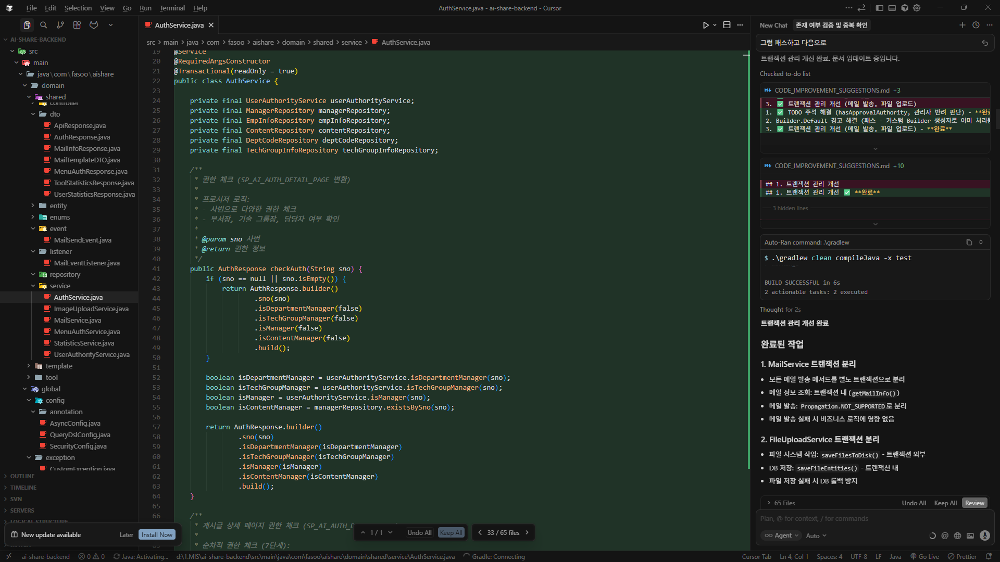

# Vibe Coding의 시작

## Vibe Coding

Vibe Coding은 생성형 인공지능의 도움을 받아 코드를 작성하는 행위를 말한다.
사람은 직관과 큰그림, 구체적인 부분은 인공지능에 맡기는 것을 의미한다.

`안드레 카파시` 가 제시한 개념으로 코드의 작동원리를 완전히 이해하지 않아도 코드를 작성한다는 점이 주요 특징이다.

이 Vibe Coding을 경험하면서 프로그래머의 생각과 방향성을 다시 한번 고민해 봐야 할 것 같다.

## 시작 계기

사내의 Legacy code 들이 `.net` 과 `IIS server`로 대부분이 구성이 되어 있는 상태였다.
이를 `Spring boot`/ `React`로 분리하고 서버는 `Docker` 서버로 전환하는 과정에서 도입을 고려하게 되었다.

대부분의 서비스 단에서 이루어져야 하는 로직은 `MSSQL`의 프로시저로 구현이 되어 있는 상태였고,
프로시저에 대한 설명을 작성한 문서는 하나도 없는 상태였다.

수많은 프로시저와 코드들을 일일이 분석하기는 힘들었고, 이에 대한 해결 방안으로 AI를 활용하고자 했다.

## 무슨 AI를 선택할까?

AI를 초기 선택은 `cursor`를 선택했다. 이유는 단순하게 팀동료의 추천으로 시작하게 되었다.

### `Cursor`

[Cursor](https://cursor.com/home?from=agents)의 경우 처음 경험하였을 때 IDE 형태로 다운로드 받아 사용할 수 있는 강점이 있었다.



경험상으론 `VS Code`를 사용하는 것과 유사하였는데, 이는 `VS Code`를 포크해서 만들었기 때문이었다.
이로 인해 프론트엔드 개발자는 동일한 IDE를 사용하는 것과 다를바 없어 무리없이 사용을 하게되었다.

그리고 나 같은 경우도 최초에 `.net` 코드를 분석 시키는 것을 `Cursor`를 통해 진행하였다.
초기 질문 같은 경우는 이해도가 부족하여,

```text
이 프로젝트를 분석하고, 이후에 Spring Boot와 React로 분리할 건데 방법을 생각해봐
```

라는 식으로 전체 내용을 던져버리는 형태로 진행하였다. 이때까지는 토큰의 소중함을 몰랐기 때문이다.
하지만 무지한 나한테도 AI 는 친절하게 분석을 진행해주었다. `.net`에 포함된 프로시저들을 모두 찾아주고, 필요한 테이블들을 분석해 주었다.


